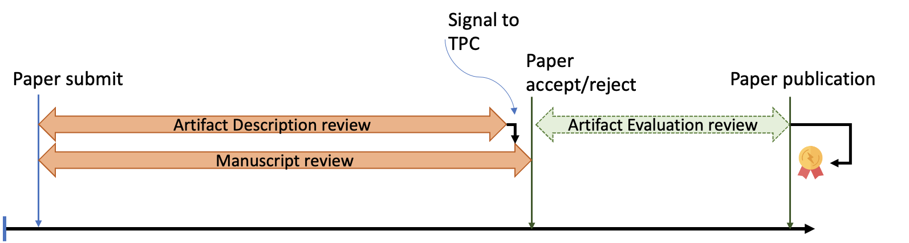
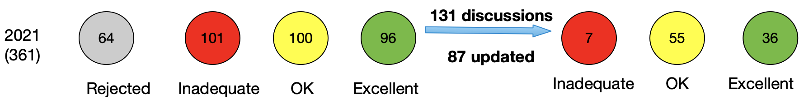
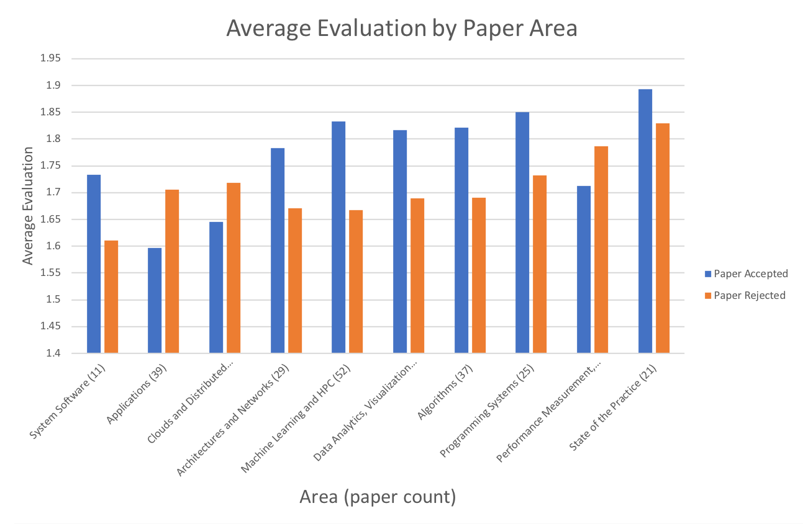
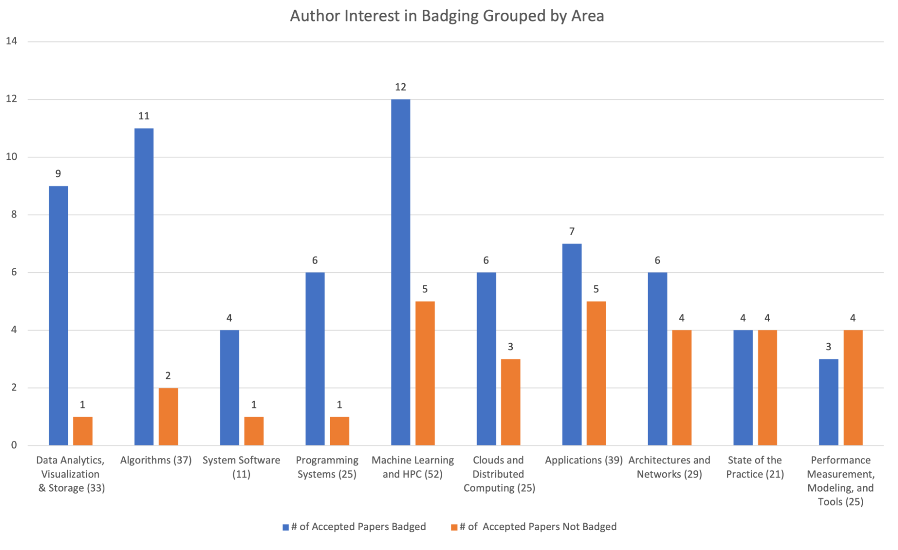

## Introduction

The objective of the reproducibility initiative at SC is to advance scientific
rigor. SC achieves this objective by allowing technical contributions to engage
in enhanced reproducibility. SC21 continued the practice of achieving enhanced
reproducibility via appendices but further developed on the structure, required
content, and evaluation of appendices, thus advancing the overall objective.
This practice comes under the sole oversight of the Artifact
Description/Artifact Evaluation (AD/AE) Committee. In this report, we highlight
some of the achievements of this committee, describing its scale, complexity,
and the dedicated effort of several members that improved the practice and
brought it to successful fruition.

SC21 AD/AE advanced the current state in several ways: (i) adopting an
incentive-based approach of engaging authors, requiring minimal involvement of
the Technical Program Committee (TPC), (ii) laying out the rules for applying
ACM Badges in a way that is consistent irrespective of the publisher, (iii)
using community computing infrastructure for Artifact Evaluation, (iv)
establishing the Best Reproducibility Advancement Award and choosing its first
recipient, and finally (v) engaging with more than 50 members of AD/AE in a
timely manner increasing awareness and enthusiasm. The AD/AE process lasted 12
months from the initial meeting between the Chairs.

## The AD/AE structure and process

To avoid confusion between AD and AE, the phases were clearly distinguished
(Figure 1). A primary issue from the start was determining how much
reproducibility should be a requirement and how much should it act as an
incentive to improve the current state. Our philosophy was to take a hybrid
approach emphasizing that reproducibility is a carrot instead of a stick.
However, we did put in one minimal form of a stick: a bit signal that indicates
to the TPC, whether the paper passes the Artifact Description reproducibility
requirement. This rule was chosen so that authors are engaged to minimally think
about reproducibility before paper submission.

Figure 1: AD and AE are independent. AD provides a signal to TPC.

The AD/AE committee consisted of 48 AD/AE committee members. 300 papers
underwent AD and 69 papers underwent AE. Each reviewer had 7-8 papers to review
in the AD phase and 3-4 artifacts to evaluate in the AE phase. Authors were
asked to apply for the badges at the time of submission of Artifact Description
submission.

The AD/AE co-chairs conducted 3 webinars in total: 2 were for reviewers to
understand AD and AE process, and 1 was for authors and reviewers combined to
understand computing infrastructure.

## Artifact Description

The AD requirements, from the author's side, consisted of filling a form asking
to report H/W, S/W requirements, environment configuration, source code links,
and details of experiments. Figure 2 shows the success of AD reporting after
each AD form was reviewed by 2 reviewers. Out of 361 papers, 64 were desk
rejects by the TPC. Out of the remaining 101 were marked inadequate ADs, 100
were marked OK, and 96 were marked Excellent. After 131 discussions, 87 of the
ADs were updated. The TPC committee was informed that 7 out of all ADs are
inadequate. Amongst the 99 papers that got accepted to SC signal, only 1 out of
the 7 non-OK ADs was accepted by the TPC and was marked as major revision. The
TPC was concerned about the artifacts description quality of this paper, and an
acceptable AD was considered as a requirement for the TPC to accept the major
revision. As the numbers report, the quality of AD after the discussion
improved, and 55 were OK and 36 were marked excellent.

Figure 2: AD initial review Vs final signal to TPC

The following Figure (Figure 3)  compares the average AD evaluation of accepted
and rejected papers across different areas. In general, as we see the evaluation
score is higher for accepted papers. We believe that ​​mere participation does
not translate to improved reproducibility---reproducibility is improved by
independent verification and the review process introduces small deadlines in
the process so authors can continue to enrich their artifacts.

Figure 3: Average AD Evaluation within SC21 Areas

The AD reviewers checked for completion of the AD form: hardware, software
requirements, compilers, documentation, and validity of Github repositories. A
text analysis of the AD requirements showed the following:  Out of the 331 AD
descriptions that we analyzed, the primary operating system of choice is Ubuntu
(113), followed by CentOS (85), Red Hat (53), Suse (18), Mac OSX (8), Fedora
(6), Windows (5), Cray (5), and others (38). The primary compiler used is GCC
with 192 mentioning it. 41 also mentioned Python. CUDA and MPI were the common
libraries that were mentioned.

The authors also mentioned some prominent computing platforms in their AD
descriptions: ORNL/Summit(20), NERSC/Cori (15), ALCF/Theta(11), TACC/Frontera
(10), Chameleon (3), ALCF/Mira (2), CloudLab(1). The following is the list of
all supercomputers that were mentioned: Lassen, ABCI, Bebop, Sunway Taihulight,
Catalyst, Blue Waters, Andes, Daint (Swiss National Supercomputing Centre),
AIST, Frontera, Shaheen-II, Fugaku, Tianhe-3, Cheyenne, Theta.

## Artifact Evaluation

The AE process for SC21 consists of reviewing artifacts for AA (Artifact
Available), AF (Artifact Functional), RR (Results Reproduced) badges. While
these badges are specific to the ACM badging system we, in collaboration with
ACM and IEEE, have ensured continuity by aligning both ACM and IEEE badges for
future conferences.

Authors were asked to apply for the badges at the time of submission of Artifact
Description submission. The following Table provides how many authors of paper
submissions and accepted papers indicated badge interest at the time of
submission. The table indicates that for some authors’, confidence in artifact
evaluation increases once the paper is accepted.

|  | At Paper Submission | After Paper Acceptance |
|:-:|:-:|:-:|
| Total number | 336 | 99 |
| Artifact Available | 188 (51.9%) | 68 (68.6%) |
| Artifact Functional | 178 (49.2%) | 59 (59.5%) |
| Results Reproduced | 165 (45.6%) | 52 (52.5%) |

Table 1: Badge Interest at the Time of AD submission Vs After Paper was Accepted

Out of 99 accepted or major revision papers 69 applied for at least 1 badge (one
paper did not apply for AA, but applied for AF). This number includes 2 major
revision papers which were later on removed from the program.

The following figure presents in which areas authors were more inclined to go
for AE badges. Clearly, the winner is data analysis and visualization in which 9
out of 10 papers wished to be badged vs on the opposite spectrum was
Performance, Measurement, and Modeling in which 4 out of 7 did not wish to be
badged. The trend is clear--more systems and tools-based papers wished to be
badged than papers in applications, state of practice, and performance
measurement which are traditionally known to be hard to reproduce areas. Even in
these difficult areas, a majority decided to apply for badges.

The AE review discussion process consisted of 133 assignments and a total of 240
reviews with an average of 1.92 out of 2 on reviews. The AE review process was
an interactive, anonymous collaboration between reviewers and authors. A total
of 879 committee-author comments were generated with the highest being 50
comments on a single paper. This data does not include interactions via Slack
and Email.

The reviewing lead to the following badge status:

|  | Artifact Available* | Artifact Functional* | Results Reproduced* |
|:-:|:-:|:-:|:-:|
| Applied for | 66 | 57 | 50 |
| Granted | 66 | 52 | 38 |
| % Badged | 100%  | 91% | 76% |

Table 2: Badging results for accepted papers
*(Excluding 2 major revisions which would have received all three badges)

Compared with all the papers, about 70% of accepted papers received at least one
badge (67 out of 97). The percent of granted badges based on the applications is
higher since we do not consider the full 98% of papers.

While we successfully completed the AE of all papers that applied for it in the
given amount of time, there was always the overarching concern of the time and
resources required to achieve AE. To assess AE, we gathered feedback from AE
reviewers on a variety of questions. We summarize the salient points of this
survey responded by 14 of the reviewers:

* 2 out of 14 did not think the evaluation criteria were entirely clear, but
  more than 92% say that the informational webinars helped.
* 75% spent 5-16 hours on the AD phase (reviewing 7-8 artifacts descriptions)
  and between 0-30 hours per artifact in the AE phase. The number of artifacts
  assigned in the AE phase was roughly 3-4 or 3.5 on average. This amounted to a
  weighted average of 13 hours per artifact or 40-50 hours overall artifacts per
  reviewer.
* More than 85% think that the number of assigned ADs was adequate. For AE, 71%
  would like 2 artifacts and 29% would like no more than 3 artifacts.
* The primary reason for inadequate ADs was that the AD description was too
  short for assessment, and either missed software requirements, hardware
  requirements or did not report version numbers. In particular, missing
  DOI/link was never the cause of rejection.
* 92% of reviewers used the comment mechanism to correspond with the authors.
  The three primary discussion topics were (i) build issues, (ii) insufficient
  documentation, and what are the primary results to be reproduced.
* 50% of the reviewers faced failures while evaluating, and 57% of the time the
  reviewers did not find adequate hardware.
* On the contrary, only 35% of the reviewers experienced authors not responding
  in time.

## Use of Community Computing Resources

SC21 partnered with computing resource providers: Chameleon, CloudLab, and
XSEDE. The three providers gave detailed presentations to authors and reviewers
for use of resources during evaluation. In SC21 AE, infrastructure was primarily
reviewer-initiated. Except for one case, the authors did not request community
computing resources. This could be attributed to the fact that the community
computing resources were introduced in June, just before the AE phase started.
Had they been introduced early in January or February we believe authors would
have heavily used them.

Requests for specialized hardware were uniquely satisfied by CloudLab such as
NVMM memories and V100 NVIDIA GPUs. Chameleon provided significant computing
resources on commonly used VMs. Chameleon generously allocated 20000 SUs out of
which 7% was used by 10 reviewers. Since the reviewer request was mapped to a
single paper, we can say that 10 papers used Chameleon for their evaluation
purposes. This is different from the 3 author-mentioned papers. Chameleon user
interface helped us also keep track of usage and the assigned reviewers.
CloudLab was used in 2 papers where specialized hardware was asked. TaCC
Fronterra was used by 3 reviewers, and Piz Daint was used by assigning a
third-party liaison, under whose access, the reviewer could perform some
evaluation anonymously. Summit was used in 3-4 papers. However, the process for
requesting access to Summit was too involved. In 2 cases, authors screen casted
their artifact reproduction to the evaluators. In yet another case, the results
were not reproduced by the AE committee due to a lack of timely access to the
TaCC H/W. In this case, the authors provided a very detailed report to the AE
committee, with screenshots to prove the validity of the Artifact Functional and
Results Reproduced badge. In other cases, the results were partially reproduced.

## Badge association and preservation of artifacts

To maintain an association between an SC paper and the artifact, we worked with
the SC website team, the ACM Digital Library (ACM DL), and sysartifacts (a
website collecting artifact evaluation results of computer systems conferences).
Our objective was to use these websites for curating and preserving the
artifacts. Both, the SC website and the ACM DL allow searching for papers with
badges and also directly link to the DOI of the artifact of the paper. While we
required a DOI for the artifact available badge, we offered authors several
alternatives for long-term storage and DOI creation including Zenodo and storing
artifacts directly in the ACM DL. For the first time in SC history, 6 artifacts
chose to store their artifacts in the ACM DL along with their paper. All these
efforts make finding an artifact of a paper as easy as possible and offer
long-term storage for the artifact avoiding failing links or removing Github
repositories. To achieve these goals, we developed and open-sourced tools to
support the required publication formats of the ACM DL.

## Best Reproducibility award selection

The SC21 Reproducibility Initiative introduced the Best Reproducibility
Advancement Award with the aim to recognize outstanding efforts in improving
transparency and reproducibility of methods for high-performance computing,
storage, networking, and analysis. On the consideration of the steering
committee and SC chairs, the award was expanded to recognize any paper or a
research object of a paper that most significantly advances the state-of-art in
transparency and reproducibility.

The Best Reproducibility Advancement Award committee consisted of a total of 11
members including the AD/E co-chairs. There were a total of 19 paper nominations
by the authors and reviewers. Four of these were excluded primarily based on
AD/AE reviews. 15 were provided to an Award Review sub-committee, which
consisted of the AD/E co-Chairs and 4 other members of the Award committee who
were also members of the AD/E program committee, and were well-versed in the art
of artifact creation. This sub-committee shortlisted 5 from the 15 to be
considered for the award. The committee met over Zoom; Each member presented a
case of why their pick should be given an award. Everyone voted on the
artifacts.

The paper won the award because of its simplicity, ability to link
supercomputing analysis to an interactive Jupyter notebook and pandas data
frames, allows for experimentation with various sized datasets, and simplicity
of the packaging.

## Lessons Learned

We learned the following lessons with the SC21 AD/AE initiative:

1. Artifact Description is a necessary precursor, but one that is currently not
   self-contained. Collectively, the AD appendices are useful to build a
   comprehensive idea about the H/W requirements for the AE phase. However, in
   its current form, the AD appendices do not provide details about (i) primary
   claims of the paper that the artifact supports, (ii) steps needed to go from
   claims to results, and (iii) results to be reproduced. Thus the form collects
   several setup details about the experiments but builds little understanding
   of the experiment from the reproducibility perspective.

2. Access to HW and  community infrastructure requires more careful planning for
   successful AE.

    Our badging of papers indicates that reproducing a large subset of SC papers is
    possible even for ones with complex H/W requirements (e.g., huge clusters,
    special HW), but, in our experience, more planning and committee organization is
    needed for a successful AE.

    The AE window ranges from 3-4 weeks. Ideally, seamless access to proper H/W
    resources should be possible during the AE reviewer assignment. However,
    currently, there is no such conference system that is linked to cloud or
    community providers. In fact,  the current situation is very far from the ideal.
    We state steps that can help chairs be better prepared:

   * Chairs must also hold webinars with community infrastructure providers well in
     advance so authors host their artifacts on these systems, to begin with.
     Authors must consider the use of containers and workflow systems to make it
     easy so different H/W requirements do not pose build and environmental issues.
     This education and outreach must begin much earlier in the submission process
     since some experiments take long time to run.

   * The process of obtaining access to supercomputing resources must be
     standardized and made easy. The access requires prior approval and is
     currently ties to the individual. This implies the chair changes the approvals
     must be reinstated. This is quite cumbersome and time-consuming. Instead, we
     hope that SC engages with the supercomputing facilities worldwide to come up
     with a reproducibility initiative policy that helps SC conduct AE in a
     seamless manner across years. This policy may include federated logins and
     passwords, liaisons, and automatic access approvals to SC AD/AE chairs
     independent of their personal details (such as visa/citizenship details etc.)
     We believe such an effort will make access to resources much easier.

   * Supercomputing facilities, on the contrary, must work towards viable
     interfaces for conducting reproducibility. We found the Chameleon project has
     the most useful interface so far in terms of tracking reviewers, authors, and
     overall compute usage. However, it still does not associate a reviewer with
     the artifact that is being evaluated. For instance, initially, reviewers
     requested access to the community infrastructure for a single artifact
     evaluation. But when we surveyed the reviewers, they reported using community
     infrastructure for as many as 3 artifacts. Thus accounting usage becomes a
     challenge.

3. The cost of AE is reasonable with author engagement and support. The
   experience was valued by reviewers and authors. Future AE’s should however
   limit the time commitment of AD/AE reviewers by limiting to 2 artifact
   evaluations per reviewer.

    As our survey results, experience indicates currently there is a noticeable
    cost of conducting an AD/AE review. Contrasting AD/AE with paper reviewing,
    the paper reviewing load of a TPC is often known in the number of papers,
    the number of hours is never monitored. The quality of review is often an
    indication of the time spent in reviewing but is something very hard to
    measure. On the contrary in AD/AE, the objective is to fix the number of
    hours and then see how much evaluation can be performed in that fixed time.
    For SC21 we had estimated 10-15 hours for AD and 20 hours per artifact for
    3-4 artifacts. Our numbers did not fall off significantly from this value;
    though reviewers mentioned that they would appreciate a lower number of
    total artifacts to be evaluated.

    We believe that setting expectations right from the beginning leads to
    almost no complaints about the process. The authors were incentivized about
    the badges and the reviewers were aware of what they were in for.
    Consequently, we believe that similar to high-quality papers published at
    SC, the AD/AE process resulted in high-quality artifacts, which will advance
    future SC research.

4. Reproducibility is a spectrum that requires constant engagement---AD/AE is
   one milepost.

    As our process indicates, we never considered AD/AE as a filtering step that
    filters papers based on scientific merit. Instead, our philosophy was to
    help authors take advantage of their AD/AE process and improve their
    artifacts in a gradual manner. Our experience indicated that addressing the
    reproducibility of the artifact at the point of submission is the best way
    to improve artifact quality because that is a time when authors are engaged
    with the research process of the paper. It will be difficult to oversee the
    reproducibility of such a large scale of papers at any later point in time.
    Not all papers reached the highest artifact quality but many papers were
    made aware of the current state via reviewer comments. While an artifact
    standard is currently missing, the large number of comments by the AD/AE
    committee indicated to us that improving an artifact requires continuous
    engagement, and a standard could pose as a policing statement and be more
    detrimental to the process.

5. If embraced and sustained, the future opens up an exciting array of
   possibilities.

    The computational reproducibility process conducted via AD/AE provides a
    unique peek into the reproducibility process. As our survey and comment
    analysis indicates, build issues and lack of documentation are the most
    common issues that prevent an artifact from being reproduced. This opens up
    an interesting set of technical possibilities in the area of package
    managers, containers, and community infrastructure. Establishing
    standardization issues that can make it easier and more accessible for the
    purposes of achieving reproducibility. We also experienced in a few cases
    how screencasting makes it much easier to evaluate. However, it does not
    involve independent evaluation by a reviewer. We believe the screencasting
    calls for improved technology solutions combining augmented reality, screen
    sharing, and collaborative environments. Finally, we believe the right set
    of incentives will keep the practice sustainable. We were proud to instate
    the Best Reproducibility Advancement award as an incentive for authors to
    improve the quality of the artifact. Similar honorable mentions on the
    reviewer side will make this process worthy of their time.

## Acknowledgments

We would like to extend our gratitude to the Reproducibility Initiative Chair
and Vice-Chair, Carlos Maltzahn and Ivo Jimenez. We would like to thank also
thank the SC21 steering and organizing committee members: Bronis R. de Supinski,
Jeffrey Hollingsworth, David Abramson, Ilkay Altintas, Mary Hall, and Todd
Gamblin for their continued support, discussions, and patience to develop an
artifact description/evaluation process based on voluntary badging. We also
thank the artifact evaluation committee for their relentless effort to review
and evaluate artifacts. We adapted the artifact evaluation process based on
established processes in operating/distributed systems and programming languages
conferences.

[Tanu Malik](https://facsrv.cs.depaul.edu/~tmalik1/), DePaul University  
[Anjo Vahldiek-Oberwagner](https://vahldiek.github.io), Intel Labs  
Artifact Description/Evaluation co-chairs  