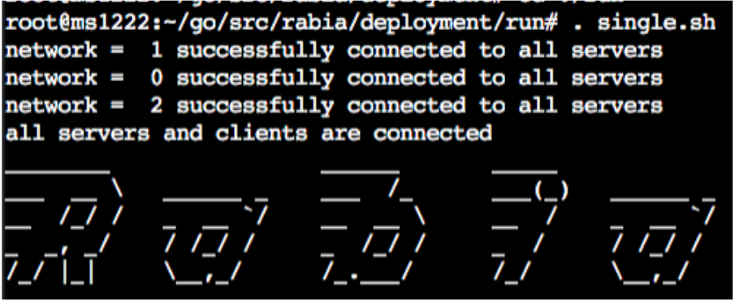
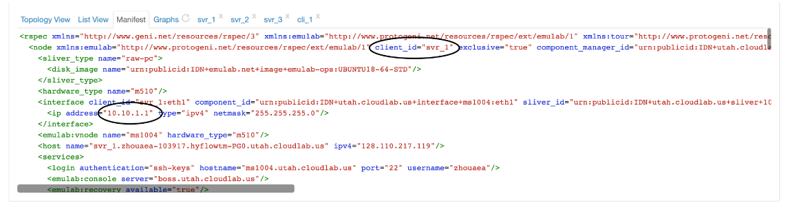



## Description of the Artifact

Links: [Artifact Location](https://github.com/haochenpan/rabia/), [Artifact Readme](https://github.com/haochenpan/rabia/blob/main/SOSP21_%20Artifact%20Evaluation_Instructions.pdf)

The submitted artifact is a public repository hosted on GitHub, including the source code, written in Go, as  well as installation and benchmarking scripts. For comparison purposes, it also includes an implementation of Paxos/EPaxos. Additionally, it provides the Redis-Rabia integration,  and a machine-checked safety proof in Ivy+Coq.

## Environment(s) Used for Testing

Three possible options:

1. CloudLab, 3 m510 as servers (8-core Intel Xeon D-1548, 64 GB RAM) and 3 c6515 as clients (32-core AMD 7452,  128GB RAM). [CloudLab profile](https://www.cloudlab.us/show-profile.php?uuid=1af34047-fb02-11eb-84f8-e4434b2381fc)
2. CloudLab, 3 m510 as servers (8-core Intel Xeon D-1548, 64 GB RAM) and 3 c6525-100g as clients (24-core AMD 7402P, 128 GB  RAM).
3. 128-core AMD EPYC machine with Docker containers, 4 cores per container, with artificially added latency to mimic a realistic cluster.

## Step-By-Step Instructions to Exercise the Artifact

### Setup: Rabia

on all VMS

```bash
sudo su && cd
mkdir -p ~/go/src && cd ~/go/src
git clone https://github.com/haochenpan/rabia.git
cd ./rabia/deployment
. ./install/install.sh
cd ./run
. single.sh
cat ../../result.txt
. clear.sh
```

if Rabia starts successfully, you should see the following:



### Disable Cores

On 3 server VMs:

```bash
sudo su
. ~/go/src/rabia/deployment/env/disable_cpu.sh
```

### Table 1

#### Rabia

* Configure VMs

  * System setup: three server VMs and one client VM

  * On **ALL VMs**, configure `~/go/src/rabia/deployment/profile/profile0.sh` by

    * Find [network ip](#find-experiment-network-ip-on-cloudlab) on CloudLab

    * Fill in ServerIps, ClientIp and Controller, let controller be the first server VM's IP:some unused port e.g.

      > ServerIps=(10.10.1.1 10.10.1.3 10.10.1.5)
      >
      > ClientIps=(10.10.1.2)
      >
      > Controller=10.10.1.1:8070

  * On **ALL VMs**, replace the “run_once” function call at the bottom of `~/go/src/rabia/deployment/run/multiple.sh` to following:

    ```bash
    run_once  ${RCFolder}/deployment/profile/profile_sosp_table1.sh
    ```

* Run Rabia

  * At the first server VM

    ```bash
    cd ~/go/src/rabia/deployment/run
    . multiple.sh
    ```

  * After 120-150 seconds, the result will show at `~/go/src/rabia/result.txt`


#### Paxos/EPaxos (Pipelining)

* Configure

  * On **ALL VMs**

    ```bash
    cd ~/go/src/rabia/epaxos/table-1
    chmod +x bin/master && chmod +x bin/server && chmod +x bin/client
    ```

  * On **ALL VMs**, configure `~/go/src/rabia/epaxos/table-1/bash_profile.sh` by

    * Find [network ip](#find-experiment-network-ip-on-cloudlab) on CloudLab

    * Fill in ServerIps, ClientIp and MasterIp, let MasterIp be the first server VM's IP, e.g.

      > ServerIps=(10.10.1.1 10.10.1.3 10.10.1.5)
      >
      > ClientIps=(10.10.1.2)
      >
      > MasterIp=10.10.1.1	

* Run Paxos

  * on Master VM

    ```bash
    . runPaxos.sh
    python3.8 analysis.py ./logs
    ```

    The result will show in the terminal

* Run EPaxos

  * on Master VM

    ```bash
    . runEPaxos.sh
    python3.8 analysis.py ./logs
    ```

    The result will show in the terminal

#### Paxos/EPaxos (Non-Pipelining)

##### Paxos

* Setup

  ```bash
  sudo su && cd
  cd ~/go/src
  git clone https://github.com/zhouaea/epaxos-single.git && cd epaxos-single
  git checkout paxos-no-pipelining-no-batching
  cd ~/go/src/epaxos-single
  . compilePaxos.sh
  ```

* Configure

  * System setup: three server VMs and one client VM
  * Choose one of your server VMs to be the master server. The other two will be replicas.
  * On master server, set `MASTER_SERVER_IP` in  `~/go/src/epaxos-single/runMasterServer.sh` to be the server's network ip.
  * On two replica servers, set `MASTER_SERVER_IP` and `REPLICA_SERVER_IP` in  `~/go/src/epaxos-single/runMasterServer.sh` to be master server's network ip and the replica's own ip respectively.
  * On the client VM, set `MASTER_SERVER_IP` in  `~/go/src/epaxos-single/runMasterServer.sh` to be the server's network ip.

* Run

  * On master server

    ```bash
    . runMasterServer.sh
    ```

  * On replica server

    ```bash
    . runServer.sh
    ```

  * On client

    ```bash
    . runClient.sh > run.txt
    ```

  * Use `ps` command to check for pending clients, after all clients finish, on client VM

    ```bash
    . calculate_throughput_latency.sh
    ```

##### EPaxos

* Setup

  ```bash
  sudo su && cd
  cd ~/go/src
  rm -rf epaxos-single
  git clone https://github.com/zhouaea/epaxos-single.git && cd epaxos-single
  git checkout epaxos-no-pipelining-no-batching
  cd ~/go/src/epaxos-single
  . compileEPaxos.sh
  ```

* Configure

  Same as Paxos

* Run

  Same as Paxos

#### Result

##### Environment 1: 3 m510 servers and 3 c6525-100g clients

|                | Rabia   | EPaxos(NP) | EPaxos   | Paxos(NP) | Paxos    |
| -------------- | ------- | ---------- | -------- | --------- | -------- |
| Throughput     | 3416.14 | 1710.35    | 11593.28 | 1712.99   | 11313.74 |
| Median Latency | 0.48    | 1.15       | 0.17     | 1.15      | 0.17     |

##### Environment 2: 3 m510 servers and 3 c6515 clients

|                | Rabia   | EPaxos(NP) | EPaxos   | Paxos(NP) | Paxos    |
| -------------- | ------- | ---------- | -------- | --------- | -------- |
| Throughput     | 3827.89 | 1714.07    | 13334.01 | 1710.21   | 11648.04 |
| Median Latency | 0.46    | 1.15       | 0.15     | 1.15      | 0.17     |


### Figure 4a,4b

#### Rabia

* Configure:

  * setup: three server VMs and three client VMs

  * On **ALL VMs**, configure `~/go/src/rabia/deployment/profile/profile_sosp_4abc.sh` by

    * Find [network ip](#find-experiment-network-ip-on-cloudlab) on CloudLab

    * Fill in ServerIps, ClientIp and Controller, let controller be the first server VM's IP:some unused port e.g.

      > ServerIps=(10.10.1.1 10.10.1.3 10.10.1.5)
      >
      > ClientIps=(10.10.1.2 10.10.1.4 10.10.1.6)
      >
      > Controller=10.10.1.1:8070

  * On **ALL VMs**, replace the “run_once” function call at the bottom of `~/go/src/rabia/deployment/run/multiple.sh` to following:

    ```bash
    run_once  ${RCFolder}/deployment/profile/profile_sosp_4abc.sh
    ```

* Run Rabia

  * At the first server VM

    ```bash
    cd ~/go/src/rabia/deployment/run
    . multiple.sh
    ```

  * The result of the 1st data point (20-client run) will show at `~/go/src/rabia/result.txt`

* To get the 2nd data point, on **ALL VMs**, comment out the 2-line block for the 20-client run and uncomment the block for the 40-client.

* Follow this pattern -- uncomment a 2-line block and comment its previous 2-line block on each machine -- to collect data points generated by 20, 40, 60, 80, 100, 200, 300, 400, and 500 clients.

#### Paxos

* Configure

  * setup: three server VMs and three client VMs

  * On **ALL VMs**

    ```bash
    cd ~/go/src/rabia/epaxos/figure-4/paxos-batching
    chmod +x bin/master && chmod +x bin/server && chmod +x bin/client
    ```

  * on **ALL VMs**, edit `~/go/src/rabia/epaxos/figure-4/paxos-batching`

    *  set `ServerIps` to be 3 servers' ips, e.g.

      ```bash
      ServerIps=(10.10.1.1 10.10.1.3 10.10.1.5)
      ```

    * set `ClientIps` to be 3 clients' ips, e.g.

      ```bash
      ClientIps=(10.10.1.2 10.10.1.4 10.10.1.6)
      ```

    * set `MasterIp` to be the first server's ip, e.g.

      ```bash
      MasterIp=10.10.1.1
      ```

* Run Paxos

  * To get the 1st data point(20 clients)

    ```bash
    . runBatchedPaxos.sh
    python3.8 ../analysis.py ./logs
    ```

  * The paper runs the Paxos/EPaxos configuration 9 times with varying clients (ranging from 20 to 500). profile0.sh contains code to run with 20 clients, while profile8.sh will run with 500 clients. To choose which profile is being executed, edit the second line of runBatchedPaxos.sh

#### EPaxos

Repeat all steps above in `~/go/src/rabia/epaxos/figure-4/epaxos-batching` to get the result for EPaxos.

### Result

#### Environment 1: 3 m510 servers and 3 c6525-100g clients

##### Rabia

| Throughput | P50 latency | P99 latency |
| ---------- | ----------- | ----------- |
| 211951.39  | 0.77        | 4.11        |
| 312803.47  | 1.04        | 4.31        |
| 399561.11  | 1.2         | 6.3         |
| 423786.11  | 1.41        | 7.49        |
| 419640.97  | 1.94        | 7.64        |
| 473751.39  | 3.28        | 11.41       |
| 478368.75  | 5.3         | 17.48       |
| 449146.53  | 7.51        | 23.82       |
| 498935.42  | 8.55        | 24.05       |

##### Paxos

| Throughput | P50 latency | P99 latency |
| ---------- | ----------- | ----------- |
| 39307.75   | 5.08        | 5.9         |
| 78641.26   | 5.08        | 6.46        |
| 116734.42  | 5.09        | 6.79        |
| 156229.16  | 5.07        | 6.56        |
| 194808.89  | 5.08        | 6.49        |
| 218141.93  | 9.17        | 12.57       |
| 224557.89  | 13.2        | 16.39       |
| 223986.13  | 17.37       | 23.24       |
| 229621.35  | 21.33       | 28.97       |

##### EPaxos

| Throughput | P50 latency | P99 latency |
| ---------- | ----------- | ----------- |
| 39293.97   | 5.08        | 5.77        |
| 78595.13   | 5.08        | 5.83        |
| 117986.76  | 5.07        | 6.59        |
| 156944.04  | 5.07        | 6.69        |
| 195805.5   | 5.08        | 6.79        |
| 344065.68  | 5.76        | 7.89        |
| 415517.05  | 7.05        | 10.49       |
| 422386.01  | 9.22        | 14.05       |
| 410920.65  | 11.82       | 17.36       |

#### Environment 2: 3 m510 servers and 3 c6515 clients

##### Rabia

| Throughput | p50  | p99   |
| ---------- | ---- | ----- |
| 217509.03  | 0.76 | 4.02  |
| 287848.61  | 1.12 | 5.44  |
| 372775.0   | 1.34 | 6.73  |
| 443747.92  | 1.38 | 5.66  |
| 422825.69  | 1.85 | 9.69  |
| 482571.53  | 3.3  | 12.47 |
| 460769.44  | 5.21 | 16.15 |
| 485519.44  | 6.76 | 23.11 |
| 468277.08  | 9.02 | 28.28 |

##### Paxos

| Throughput | p50   | p99   |
| ---------- | ----- | ----- |
| 39234.64   | 5.09  | 5.8   |
| 78568.32   | 5.08  | 6.73  |
| 116862.58  | 5.08  | 7.17  |
| 156337.12  | 5.07  | 6.77  |
| 195220.45  | 5.06  | 6.69  |
| 239637.86  | 8.06  | 11.38 |
| 241822.38  | 12.21 | 17.4  |
| 221524.82  | 17.47 | 24.77 |
| 230067.95  | 21.37 | 27.4  |

##### EPaxos

| Throughput | p50   | p99   |
| ---------- | ----- | ----- |
| 39256.35   | 5.09  | 5.89  |
| 78604.45   | 5.08  | 6.26  |
| 117854.99  | 5.07  | 6.51  |
| 156889.47  | 5.07  | 6.81  |
| 194883.38  | 5.08  | 6.96  |
| 343064.6   | 5.77  | 7.87  |
| 396995.58  | 7.43  | 10.99 |
| 404807.29  | 9.7   | 13.97 |
| 394188.47  | 12.44 | 17.02 |

###  Varying Data Size (No Figure or Table)

#### Rabia

* Configure:

  * setup: three server VMs and three client VMs

  * The base configuration for comparison (the setup of that produces Figure 4a) uses 16B key-value pairs. For this section, change the size to 256B: at each VM,  in `internal/config/config.go`, at line 162-163, set

    ```go
    c.KeyLen = 128, c.ValLen = 128
    ```

  * On **ALL VMs**, edit `ServerIps, ClientIps, Controller` in `profile_sosp_vd.sh`

  * On **ALL VMs**, replace the “run_once” function call at the bottom of `deployment/run/multiple.sh` to the followings:

    ```bash
    run_once  ${RCFolder}/deployment/profile/profile_sosp_vd.sh
    ```

* Run Rabia

  * At the first server VM

    ```bash
    cd ~/go/src/rabia/deployment/run
    . multiple.sh
    ```

  * The result will show at `~/go/src/rabia/result.txt`

#### Paxos

* Configure:

  * setup: three server VMs and three client VMs

  * On  **ALL VMs**

    ```bash
    cd ~/go/src/rabia/epaxos/varying-data-size/paxos-batching-data-size-256B
    ```

* Repeat steps in [Previous Section](#figure-4a4b)

#### EPaxos

* Configure:

  * setup: three server VMs and three client VMs

  * On  **ALL VMs**

    ```bash
    cd ~/go/src/rabia/epaxos/varying-data-size/epaxos-batching-data-size-256B
    ```

* Repeat steps in [Previous Section](#figure-4a4b)

#### Result

|           | Rabia     | EPaxos    | Paxos     |
| --------- | --------- | --------- | --------- |
| 16B       | 473751.39 | 344065.68 | 218141.93 |
| 256B      | 267113.89 | 263065.79 | 139352.29 |
| reduction | 0.44      | 0.24      | 0.36      |

|           | Rabia       | EPaxos      | Paxos       |
| --------- | ----------- | ----------- | ----------- |
| 16B       | 543554.17   | 341262.96   | 211863.06   |
| 256B      | 258776.39   | 267593.56   | 138952.76   |
| reduction | 0.523917938 | 0.215872827 | 0.344138804 |

### Integration with Redis (Figure 5)

#### Sync-Rep

* Configure

  * There are two configurations:

    * Sync-Rep (1): two VMs, one as the Redis leader and the other as a follower
    * Sync-Rep (2): three VMs, one as the Redis leader and the other two as
      followers

  * On **ALL VMs**

    ```bash
    cd ~/go/src
    git clone https://github.com/YichengShen/redis-sync-rep.git
    cd redis-sync-rep
    ```

  * Configure IP of master VM in `config.yaml`

  * Start Redis server: You could configure the current VM either as a master or a
    replica

    * configure as a master

      ```bash
      . ./deployment/startRedis/startServer.sh
      ```

    * configure as a replica

      ```bash
      . ./deployment/startRedis/startServer.sh replica
      ```

* Run

  * To get the low bar, edit following parameters in `config.yaml`

    ```yaml
    NClients=1 and ClientBatchSize=1
    ```

    then on one of the follower VMs, run the main program

    ```bash
    go run main.go
    ```

  * To get the high bar, edit following parameters in `config.yaml`

    ```yaml
    NClients=15 and ClientBatchSize=20
    ```

    then on one of the follower VMs, run the main program

    ```bash
    go run main.go
    ```

#### Redis-Rabia

* Configure

  * setup: three server VMs and three client VMs

  * For each of the three Rabia **server VMs**, start a stand-alone Redis instance on the VM (n server requires n Redis instance), and start a client to monitor the Redis:

    ```bash
    # on server-0
    src/redis-server --port 6379 --appendonly no --save "" --daemonize yes
    src/redis-cli -p 6379
    # on server-1
    src/redis-server --port 6380 --appendonly no --save "" --daemonize yes
    src/redis-cli -p 6380
    # on server-2
    src/redis-server --port 6381 --appendonly no --save "" --daemonize yes
    src/redis-cli -p 6381
    ```

  * Adjust the `StorageMode` to 2 in `internal/config/config.go (line 171)` on **all VMs**

    ```go
    c.StorageMode = 2
    ```

  * Set `ServerIps, ClientIps, Controller` in `profile_sosp_5a.sh` and `profile_sosp_5b.sh`

* Run

  * To get the low bar

    * Replace the “run_once” function call at the bottom of `deployment/run/multiple.sh` to the followings:

      ```bash
      run_once  ${RCFolder}/deployment/profile/profile_sosp_5a.sh
      ```

    * On the master server,

      ```bash
      cd ~/go/src/rabia/deployment/run
      . multiple.sh
      ```

    * Run `flushall` in redis-cli to truncate the DB to prepare for the next clean run

  * To get the high bar,

    * Replace the “run_once” function call at the bottom of `deployment/run/multiple.sh` to the followings:

      ```bash
      run_once  ${RCFolder}/deployment/profile/profile_sosp_5b.sh
      ```

    * On the master server,

      ```bash
      cd ~/go/src/rabia/deployment/run
      . multiple.sh
      ```

#### Result

> As some evaluators fails to run part of the experiment, the table below is a combination from multiple evaluators' results.

|      | Sync-Req (1) | Sync-Req (2) | RedisRabia |
| ---- | ------------ | ------------ | ---------- |
| low  | 9090.91      | 4878         | 5933.71    |
| high | 400000       | 324324       | 436042.86  |

## How The Artifact Supports The Paper

### Artifact Available

* The paper have been placed on a public repository on Github

### Artifact Functional

* The artifact has high-level documentation including code structure, supported environments, dependencies, configuration, and use.
* The artifact includes an exercisable example.
* The artifact is complete with respect to what the paper describes.
* We're able to run most of the experiments, except
  * Figure 4c/4d, which requires servers in different availability zones
  * Figure 5 Redis-Raft, which fails to run

### Result Replicated

* Table 1
  * The paper claims that the throughput of Rabia is comparable to that of  EPaxos, according to our reproduced result, Rabia is much better than  EPaxos on Cloudlab. Though the latencies of all protocols mentioned are much lower than those on paper, the ratio seems to be in line. 
  * In our result, Paxos and EPaxos have similar performace, while in the paper, EPaxos outperforms Paxos. In a follow-up response from the authors, they are not able to reproduce Table 1's number for Paxos, after discussion with their shepherd, they decide to update Table 1 in the camera-ready version.

* Figure 4ab
  * The overall shape of the graphs matches the paper.
* Varying data size
  * The paper claims that EPaxos and Paxos suffer 71% and 56% reduction in throughput, whereas Rabia has less (47%) reduction.  However, we observed more slowdown in Rabia than Paxos/EPaxos.
* Figure 5
  * We failed to run RedisRaft, thus it's not covered here.
  * The trend of our result is similar to that of authors' result.


Considering the different environments used by us (CloudLab) and the authors (Google Cloud Platform), the variance of the results is expected. Although one of our results (varying data size) contradicts the paper's claim, given this paper's main contributions are the simplicity of the algorithm and the comparable performance with baselines, we think overall the artifact meets the criteria of the 'Reproduced' badge.


## Additional Notes and Resources

### Find experiment network IP on CloudLab



